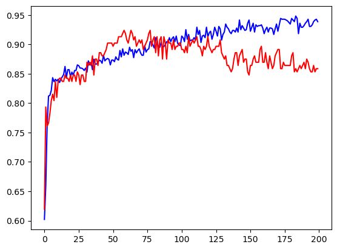

# Heart Disease Classification Project

## Project Overview
This project aims to classify heart disease patients using a deep neural network (DNN) implemented with Keras and TensorFlow. The dataset contains various patient attributes and labels indicating heart disease presence.

## Dataset
The dataset used for this project is a CSV file with the following columns:
- **Age**
- **Sex**
- **ChestPainType**
- **RestingBP**
- **Cholesterol**
- **FastingBS**
- **RestingECG**
- **MaxHR**
- **ExerciseAngina**
- **Oldpeak**
- **ST_Slope**
- **HeartDisease**

## Model Architecture
The deep neural network (DNN) used for classification is composed of six layers, including three dropout layers to prevent overfitting. The key details of the model are:
- **Layers**: Six layers in total.
- **Dropout Layers**: Three dropout layers with the following dropout rates:
  - First dropout layer: 20% of the nodes dropped.
  - Second dropout layer: 50% of the nodes dropped.
  - Third dropout layer: 30% of the nodes dropped.
  
## Evaluation Metrics
The model was trained and evaluated based on the following metrics:
- **Accuracy**: The training and validation accuracy were tracked and compared.
- **Loss**: The training and validation loss were also compared.

## Comparison and Visualization
The performance of the model was visualized with the following charts:

1. **Accuracy and Validation Accuracy Comparison**
   
   

2. **Loss and Validation Loss Comparison**
   
   

